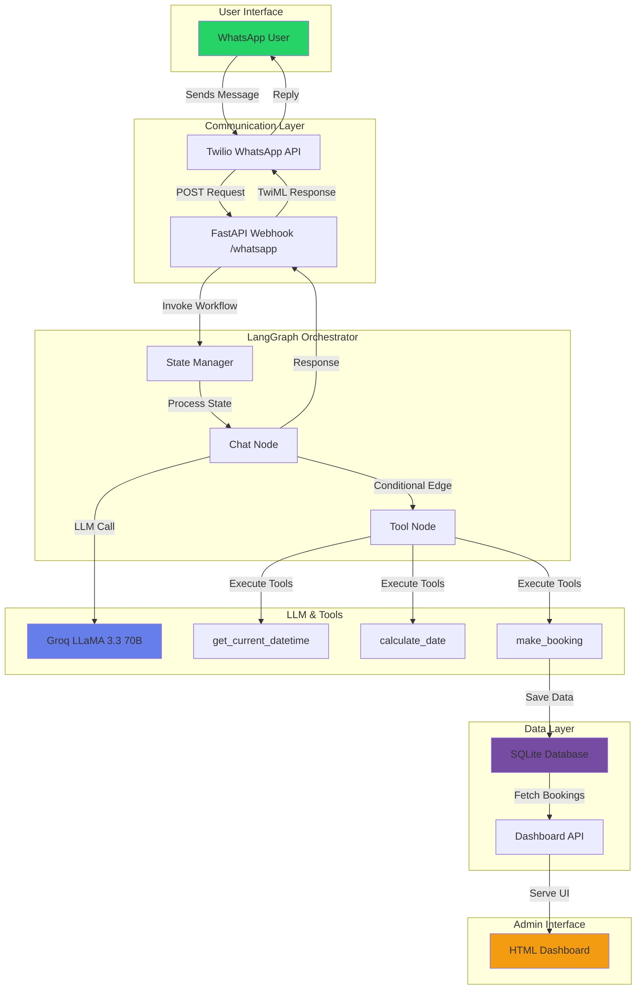
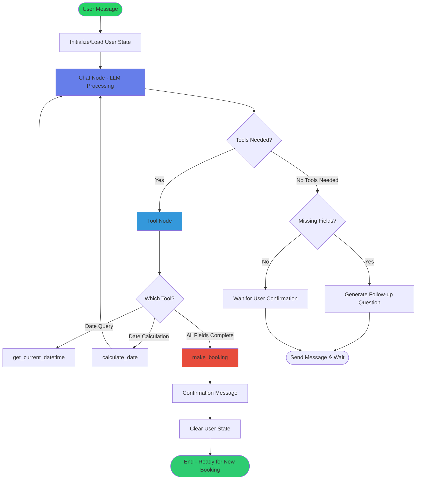
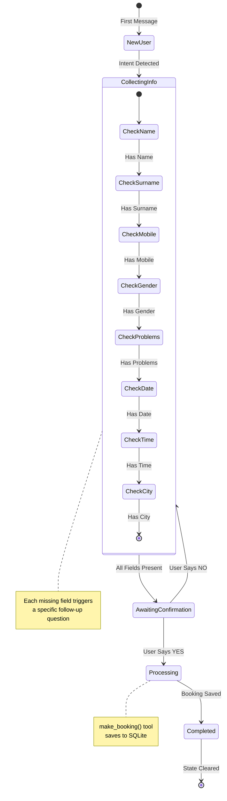

# WhatsApp Appointment Assistant

A **DAG-based conversational AI assistant** built with **LangGraph + LangChain**, integrated with **WhatsApp** via Twilio to intelligently handle appointment bookings through natural conversation.

This project demonstrates how **LLM-driven workflows** can understand free-form messages, dynamically ask follow-up questions, and execute tools only when conditions are met—all modeled as a **Directed Acyclic Graph (DAG)**.

---

## Video Demo

[](https://youtu.be/tMOti8GUmec)

---

## Project Overview

Users can book hospital appointments via WhatsApp by sending natural messages like:

> "I want to book a doctor appointment tomorrow at 7pm"

The assistant autonomously:

1. **Detects intent** - Identifies if the user wants to book an appointment
2. **Extracts entities** - Pulls out date, time, service, and user details
3. **Validates data** - Checks for missing required fields
4. **Asks follow-ups** - Dynamically requests missing information
5. **Confirms booking** - Summarizes details and asks for confirmation
6. **Registers appointment** - Saves to database and displays on dashboard

All logic flows through **graph nodes** instead of nested if-else statements.

---

## System Architecture



---

## LangGraph Workflow Architecture



---

## State Management Flow



---

## Tech Stack

| Component | Technology | Purpose |
|-----------|-----------|---------|
| **Messaging** | WhatsApp via Twilio | User communication interface |
| **Webhook Server** | FastAPI | Handles incoming/outgoing messages |
| **LLM Orchestration** | LangGraph | DAG-based conversation flow |
| **Language Model** | Groq (LLaMA 3.3 70B) | Natural language understanding |
| **Alternative LLM** | Google Gemini 1.5 Flash | Optional free alternative |
| **State Management** | LangGraph State (TypedDict) | Conversation context persistence |
| **Database** | SQLite | Appointment storage |
| **Dashboard** | HTML/CSS/JavaScript | Admin interface for appointments |
| **Date/Time Tools** | Python datetime | Dynamic date calculations |

---

## Project Structure

```
whatsapp_appointment_assistant/
│
├── main.py                    # FastAPI server with webhook endpoints
├── agent.py                   # LangGraph workflow definition
├── db.py                      # SQLite database operations
│
├── .env                       # Environment variables (create from env_sample.txt)
├── env_sample.txt             # Environment template
├── requirements.txt           # Python dependencies
│
├── appointments.db            # SQLite database (auto-created)
└── README.md                  # This file
```

---

## Core Components Deep Dive

### 1. State Schema (`agent.py`)

```python
class state_llm(TypedDict):
    messages: Annotated[list[BaseMessage], operator.add]  # Conversation history
    done: bool                                             # Booking completion flag
```

**Why this matters:**
- `messages` accumulates all conversation turns
- `operator.add` ensures messages are appended, not replaced
- `done` flag triggers state reset after successful booking

---

### 2. Tool Definitions

#### Tool 1: `get_current_datetime()`
```python
@tool
def get_current_datetime():
    """Returns current date, time, and day of week"""
```
**Use case:** When user says "today", "now", or asks about current time

#### Tool 2: `calculate_date(days_offset: int)`
```python
@tool
def calculate_date(days_offset: int = 0):
    """Calculate date from offset (0=today, 1=tomorrow, etc.)"""
```
**Use case:** When user says "tomorrow", "day after tomorrow", "in 3 days"

#### Tool 3: `make_booking(data: booking_data)`
```python
@tool
def make_booking(data: booking_data):
    """Save appointment to database - ONLY when ALL fields present"""
```
**Critical:** This tool is called ONLY after:
- All 8 required fields are collected
- User confirms with "YES"

---

### 3. Data Validation Schema

```python
class booking_data(BaseModel):
    name: str                                    # First name
    surname: str                                 # Last name
    problems: list[str]                          # Symptoms/issues
    mobile_no: int                               # 10-digit number (validated)
    gender: Literal["male", "female"]            # Restricted choices
    booking_date: str                            # YYYY-MM-DD format
    booking_time: str                            # HH:MM 24-hour format
    city: str                                    # Location
```

**Validation:**
- `mobile_no`: Must be 10 digits (1000000000 ≤ x ≤ 9999999999)
- `gender`: Only accepts "male" or "female"
- `booking_date`: Auto-validated by Pydantic as string
- `booking_time`: Converted from "7pm" → "19:00"

---

### 4. System Prompt Strategy

The LLM receives these critical instructions:

```
1. ALWAYS use get_current_datetime() or calculate_date() for date references
2. Convert 12-hour to 24-hour format (7pm → 19:00)
3. Never guess dates or times
4. Only call make_booking() when ALL 8 fields are present
5. Keep responses WhatsApp-friendly with emojis
```

---

### 5. Graph Node Execution

#### Chat Node (`chat_node()`)
```python
def chat_node(state: state_llm) -> state_llm:
    # 1. Inject system message if not present
    # 2. Call LLM with tools bound
    # 3. Append response to state
    # 4. Check if booking completed (DONE flag)
    # 5. Clear history if done
```

#### Tool Node (Built-in `ToolNode`)
```python
tool_node = ToolNode(tools)
# Automatically executes requested tools
# Returns results to chat_node
```

---

### 6. Conditional Routing

```python
graph.add_conditional_edges(
    "chat_node",
    tools_condition,           # Built-in LangGraph condition
    {
        "tools": "tool_node",  # If LLM requests tools
        "__end__": END         # If no tools needed
    }
)
```

**How it works:**
- LangGraph checks if LLM response contains tool calls
- Routes to `tool_node` if yes
- Goes to `END` if no tools needed

---

## Database Schema

```sql
CREATE TABLE bookings (
    id INTEGER PRIMARY KEY AUTOINCREMENT,
    name TEXT,
    surname TEXT,
    problems TEXT,              -- Comma-separated list
    mobile_no TEXT,
    gender TEXT,
    booking_date TEXT,          -- YYYY-MM-DD
    booking_time TEXT,          -- HH:MM
    city TEXT,
    created_at TIMESTAMP DEFAULT CURRENT_TIMESTAMP
);
```

**Operations available:**
- `save_booking(data)` - Insert new appointment
- `get_all_bookings()` - Fetch all appointments (sorted by date/time)
- `get_bookings_by_date(date)` - Filter by specific date
- `delete_booking(id)` - Remove appointment
- `get_booking_stats()` - Get today's and total counts

---

## API Endpoints

| Method | Endpoint | Description |
|--------|----------|-------------|
| `POST` | `/whatsapp` | Twilio webhook for incoming messages |
| `GET` | `/` | HTML dashboard interface |
| `GET` | `/api/bookings` | Fetch all bookings as JSON |
| `DELETE` | `/api/bookings/{id}` | Remove booking by ID |

---

## User State Management

```python
user_states = {}  # In-memory storage per phone number

# Each user gets isolated state:
user_states["+1234567890"] = {
    "messages": [HumanMessage(...), AIMessage(...)],
    "done": False
}
```

**Important:** State is cleared after successful booking to prevent context leakage between appointments.

---

## Environment Variables

Create `.env` file from `env_sample.txt`:

```env
# Required for LLM
GROQ_API_KEY=your_groq_api_key_here

# Alternative LLM (uncomment in agent.py to use)
GOOGLE_API_KEY=your_google_api_key_here

# Required for WhatsApp
TWILIO_ACCOUNT_SID=your_twilio_account_sid
TWILIO_AUTH_TOKEN=your_twilio_auth_token

# Optional (for LangSmith tracing)
LANGCHAIN_API_KEY=your_langchain_api_key
HF_TOKEN=your_huggingface_token
```

---

## Installation & Setup

### 1. Clone Repository

```bash
git clone https://github.com/yourusername/whatsapp-appointment-assistant.git
cd whatsapp-appointment-assistant
```

### 2. Install Dependencies

```bash
pip install -r requirements.txt
```

**Required packages:**
- `fastapi` - Web framework
- `uvicorn` - ASGI server
- `langgraph` - Graph orchestration
- `langchain-openai` - LLM integration
- `langchain-groq` - Groq LLM provider
- `langchain-google-genai` - Google Gemini (alternative)
- `twilio` - WhatsApp integration
- `pydantic` - Data validation
- `python-dotenv` - Environment management

### 3. Configure Environment

```bash
cp env_sample.txt .env
# Edit .env with your credentials
```

### 4. Get API Keys

**Groq (Recommended - FREE):**
1. Visit https://console.groq.com
2. Create account and generate API key
3. Add to `.env` as `GROQ_API_KEY`

**Twilio WhatsApp:**
1. Visit https://console.twilio.com
2. Get Account SID and Auth Token
3. Enable WhatsApp Sandbox or get production number
4. Add credentials to `.env`

### 5. Run Server

```bash
uvicorn main:app --reload --host 0.0.0.0 --port 8000
```

### 6. Expose Webhook (Development)

```bash
# Using ngrok
ngrok http 8000

# Copy HTTPS URL (e.g., https://abc123.ngrok.io)
```

### 7. Configure Twilio Webhook

1. Go to Twilio Console → WhatsApp Sandbox Settings
2. Set webhook URL: `https://your-ngrok-url.ngrok.io/whatsapp`
3. Method: `POST`

---

## Dashboard Features

Access at `http://localhost:8000/`

**Statistics:**
- Today's appointments count
- Tomorrow's appointments count
- Total appointments

**Filters:**
- All appointments
- Today only
- Tomorrow only
- Upcoming (next 7 days)

**Auto-refresh:** Every 30 seconds

**Actions:**
- View all booking details
- Delete appointments
- Real-time updates

---

## Example Conversation Flow

```
User: I want to book a doctor appointment

Bot: Sure! 😊 I'd be happy to help you book an appointment. 
     May I know your first name?

User: Anish

Bot: Thank you, Anish! What's your surname?

User: Deshmukh

Bot: Got it! What's your mobile number?

User: 9876543210

Bot: Perfect! Are you male or female?

User: Male

Bot: What health problems or symptoms are you experiencing?

User: Fever and headache

Bot: I understand. Which city would you like the appointment in?

User: Pune

Bot: What date would you prefer for the appointment?

User: Tomorrow

Bot: [Calls calculate_date(1) tool]
     And what time would work best for you?

User: 7pm

Bot: Let me confirm your appointment:
     
     📋 Name: Anish Deshmukh
     📱 Mobile: 9876543210
     ⚧ Gender: Male
     🏙️ City: Pune
     📅 Date: 2026-01-17
     🕐 Time: 19:00
     🩺 Problems: Fever and headache
     
     Please reply YES to confirm or NO to make changes.

User: YES

Bot: ✅ Thank you! Your appointment has been successfully booked 
     for 2026-01-17 at 19:00 in Pune.

[State cleared - ready for next booking]
```

---

## Key Technical Decisions

### Why LangGraph Over LangChain Chains?

**Traditional LangChain:**
```python
# Hard to manage complex conditionals
chain = prompt | llm | output_parser
```

**LangGraph Advantage:**
```python
# Clear, visual workflow
graph.add_edge("chat_node", "tool_node")
graph.add_conditional_edges("chat_node", tools_condition, {...})
```

**Benefits:**
- ✅ Visual debugging with graph visualization
- ✅ Conditional branching without nested if-else
- ✅ State persistence across conversation turns
- ✅ Easy to add new nodes (reschedule, cancel)

---

### Why Groq LLaMA 3.3 70B?

**Comparison:**

| Model | Speed | Cost | Function Calling |
|-------|-------|------|------------------|
| GPT-4 | Slow | $$$ | ✅ Excellent |
| Gemini 1.5 Flash | Fast | Free | ✅ Good |
| **Groq LLaMA 3.3** | **Fastest** | **Free** | **✅ Excellent** |

**Groq provides:**
- 70B parameter model (comparable to GPT-3.5)
- Sub-second response times
- Free tier (generous limits)
- Native function calling support

---

### State Reset Strategy

```python
if "DONE:" in response.content:
    state["done"] = True
    state["messages"] = [response]  # Keep only confirmation
```

**Why clear state after booking?**
- Prevents conversation bleed between appointments
- Ensures each booking starts fresh
- Avoids LLM confusion from previous context
- Reduces token usage

---

## Production Deployment

### Option 1: Railway

```bash
# Install Railway CLI
npm install -g @railway/cli

# Login and deploy
railway login
railway init
railway up
```

### Option 2: Render

1. Create `render.yaml`:
```yaml
services:
  - type: web
    name: whatsapp-assistant
    runtime: python
    buildCommand: pip install -r requirements.txt
    startCommand: uvicorn main:app --host 0.0.0.0 --port $PORT
```

2. Connect GitHub repo to Render

### Option 3: Docker

```dockerfile
FROM python:3.11-slim

WORKDIR /app
COPY requirements.txt .
RUN pip install -r requirements.txt

COPY . .

CMD ["uvicorn", "main:app", "--host", "0.0.0.0", "--port", "8000"]
```

```bash
docker build -t whatsapp-assistant .
docker run -p 8000:8000 --env-file .env whatsapp-assistant
```

---

## Future Enhancements

- [ ] **Appointment Rescheduling** - Add reschedule intent + tool
- [ ] **Cancellation Flow** - Cancel by appointment ID or date
- [ ] **Google Calendar Sync** - Auto-create calendar events
- [ ] **SMS Reminders** - Send reminders 24h before appointment
- [ ] **Multi-language Support** - Detect and respond in user's language
- [ ] **Voice Note Support** - Transcribe voice messages via Whisper
- [ ] **Payment Integration** - Collect advance payments via Stripe
- [ ] **Doctor Assignment** - Route to available doctors automatically
- [ ] **PostgreSQL Migration** - Scale beyond SQLite
- [ ] **Admin Authentication** - Secure dashboard with login

---

## Troubleshooting

### Issue: LLM not calling tools

**Solution:** Check system prompt includes tool usage instructions

### Issue: Date parsing fails

**Solution:** Ensure `get_current_datetime()` is called before date extraction

### Issue: State not persisting

**Solution:** Verify `user_states[user_number]` is correctly updated

### Issue: Dashboard not updating

**Solution:** Check if auto-refresh is enabled (30s interval)

### Issue: Twilio webhook errors

**Solution:** Verify ngrok URL is HTTPS and webhook is set to POST

---

## Contributing

Contributions are welcome! Please:

1. Fork the repository
2. Create feature branch (`git checkout -b feature/AmazingFeature`)
3. Commit changes (`git commit -m 'Add AmazingFeature'`)
4. Push to branch (`git push origin feature/AmazingFeature`)
5. Open Pull Request

---

## License

This project is licensed under the MIT License - see the [LICENSE](LICENSE) file for details.

---

## Acknowledgments

- **LangGraph** - Built by LangChain AI for agent orchestration
- **Groq** - Lightning-fast LLM inference
- **Twilio** - WhatsApp Business API integration
- **FastAPI** - Modern Python web framework

---

## Contact & Support

**Project Author:** Anish Deshmukh

For questions or issues, please open a GitHub issue or reach out via the repository discussions.

---

**Built with LangGraph - Demonstrating production-grade conversational AI workflows**
