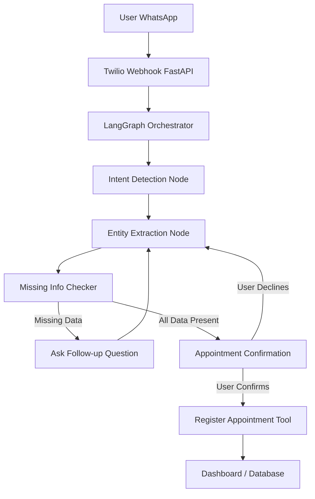
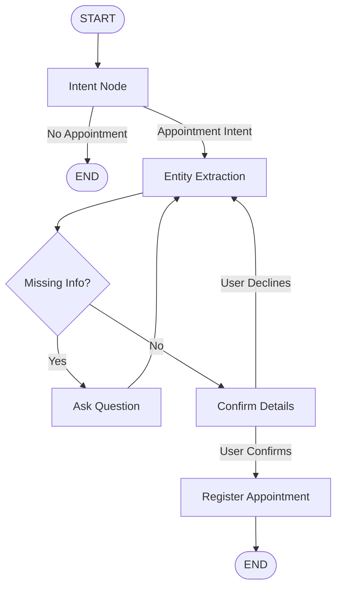

# WhatsApp Appointment Assistant

A **DAG-based conversational assistant** built using **LangGraph + LangChain**, integrated with **WhatsApp** to intelligently register appointments based on user intent.

This project demonstrates how **LLM-driven workflows** can:

- Understand free-form WhatsApp messages
- Ask follow-up questions dynamically
- Call tools only when required
- Register appointments to a backend dashboard

The entire system is modeled as a **Directed Acyclic Graph (DAG)** using LangGraph.

---

## Video Demo

[](https://youtu.be/tMOti8GUmec)

---

## Project Overview

**WhatsApp Appointment Assistant** allows users to book appointments via simple WhatsApp chats like:

> "I want to book a doctor appointment tomorrow"

The assistant:

1. Detects intent (appointment booking)
2. Extracts known details (date, service)
3. Asks follow-up questions if data is missing
4. Confirms details
5. Registers the appointment using backend tools

All of this happens through a **graph-based workflow**, not linear code.

---

## Why LangGraph?

LangGraph enables:

- **Stateful conversations** - maintains context across messages
- **Conditional branching** - dynamic decision-making
- **Tool calling** - executes actions only when conditions are met
- **Clean separation of logic** - modular and maintainable code

Instead of writing nested `if-else` logic, the assistant flows through **nodes** connected as a **DAG**.

---

## System Architecture



---

## DAG Workflow Explained

### 1. Intent Detection Node

**Purpose:** Determines what the user wants to do

**Example intents:**
- Book appointment
- Reschedule appointment
- Cancel appointment
- General inquiry

If intent is not appointment-related, the conversation ends politely.

---

### 2. Entity Extraction Node

**Purpose:** Extracts structured data from chat

**Entities extracted:**
- Date
- Time
- Service / Department
- User name
- Phone number

This uses the LLM with prompt templates.

---

### 3. Missing Information Checker

**Purpose:** Validates required fields

```python
required_fields = ["date", "time", "service"]
```

**Logic:**
- If any field is missing → go to Follow-up Node
- If all present → continue to confirmation

---

### 4. Follow-up Question Node

**Purpose:** Asks **only one relevant question at a time**

**Example:**

> "What time would you prefer for the appointment?"

The user response loops back into the graph.

---

### 5. Confirmation Node

**Purpose:** Summarizes collected details

**Example:**

> "Confirm your appointment on 16 Jan at 10 AM for Dental Checkup. Reply YES or NO."

- If NO → graph adjusts data
- If YES → proceed to registration

---

### 6. Register Appointment Tool Node

**Purpose:** Calls backend tool only after confirmation

```python
register_appointment(data)
```

This writes data to:
- Database
- Dashboard
- Google Sheet / CRM (optional)

---

## Workflow Graph



---

## Tech Stack

| Layer             | Technology          |
| ----------------- | ------------------- |
| Messaging         | WhatsApp (Twilio)   |
| Backend           | FastAPI             |
| LLM Orchestration | LangGraph           |
| LLM               | OpenAI / Gemini     |
| State Handling    | LangGraph State     |
| Database          | SQLite / PostgreSQL |
| Deployment        | Docker / Cloud      |

---

## Project Structure

```
whatsapp_appointment_assistant/
│
├── app.py                 # FastAPI webhook
├── graph/
│   ├── state.py           # Conversation state
│   ├── nodes.py           # Graph nodes
│   ├── tools.py           # Appointment tools
│   └── graph.py           # DAG definition
│
├── prompts/
│   ├── intent.txt
│   ├── extract.txt
│   └── followup.txt
│
├── services/
│   └── appointment_db.py
│
├── .env.example
├── requirements.txt
└── README.md
```

---

## Environment Variables

Create a `.env` file with the following variables:

```env
OPENAI_API_KEY=your_openai_api_key
GOOGLE_API_KEY=your_google_api_key
TWILIO_ACCOUNT_SID=your_twilio_sid
TWILIO_AUTH_TOKEN=your_twilio_token
TWILIO_WHATSAPP_NUMBER=+14155238886
```

---

## Example Conversation

```
User: I want to book an appointment

Bot: Sure! Which service do you need?

User: Dentist

Bot: What date would you prefer?

User: Tomorrow

Bot: What time should I book it for?

User: 10 AM

Bot: Confirm appointment on 17 Jan at 10 AM for Dentist. Reply YES or NO.

User: YES

Bot: Your appointment has been registered successfully!
```

---

## Key Highlights

- **DAG-based conversational flow** - clean, maintainable logic
- **Stateless WhatsApp → Stateful Graph** - seamless state management
- **Dynamic follow-up questions** - intelligent information gathering
- **Safe tool calling** - actions only after validation
- **Easily extendable** - add reschedule, cancel, and more features

---

## Getting Started

### Installation

```bash
# Clone the repository
git clone https://github.com/yourusername/whatsapp-appointment-assistant.git
cd whatsapp-appointment-assistant

# Install dependencies
pip install -r requirements.txt

# Set up environment variables
cp .env.example .env
# Edit .env with your credentials
```

### Running the Application

```bash
# Start the FastAPI server
uvicorn app:app --reload --host 0.0.0.0 --port 8000
```

### Twilio Configuration

1. Set up a Twilio account and WhatsApp sandbox
2. Configure webhook URL: `https://your-domain.com/webhook`
3. Update `.env` with Twilio credentials

---

## Future Enhancements

- Calendar sync (Google Calendar integration)
- Automated appointment reminders
- Multi-language support
- Admin dashboard for appointment management
- Voice note support
- Payment integration
- SMS fallback option

---

## Contributing

Contributions are welcome! Please feel free to submit a Pull Request.

1. Fork the repository
2. Create your feature branch (`git checkout -b feature/AmazingFeature`)
3. Commit your changes (`git commit -m 'Add some AmazingFeature'`)
4. Push to the branch (`git push origin feature/AmazingFeature`)
5. Open a Pull Request

---

## License

This project is licensed under the MIT License - see the [LICENSE](LICENSE) file for details.

---

## Acknowledgments

- Built with [LangGraph](https://github.com/langchain-ai/langgraph)
- Powered by [LangChain](https://github.com/langchain-ai/langchain)
- WhatsApp integration via [Twilio](https://www.twilio.com/)

---

## Conclusion

This project showcases a **production-grade conversational AI system** using LangGraph, demonstrating how complex decision-making can be modeled cleanly using graphs instead of traditional control flow.

Perfect for:
- AI agents
- Workflow automation
- Business chatbots
- SaaS backends

---

**Built as part of the WhatsApp LangGraph Assistant project**
